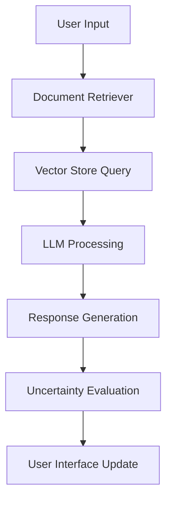

# Medical Assistant Bot

A comprehensive medical assistant bot that integrates Retrieval-Augmented Generation (RAG) for real-time analysis using locally deployed Large Language model (LLMs). The system provides detailed information about medicines, including their purpose, side effects, drug composition, key ingredients, age group, dosage, and timing.

## Table of Contents

- [Overview](#overview)
- [System Architecture](#system-architecture)
- [Uncertainty Indicators](#uncertainty-indicators)
- [Installation](#installation)
- [Usage](#usage)
- [Evaluation Parameters](#evaluation-parameters)
- [Screenshots](#screenshots)
- [Contact](#contact)

## Overview

The Medical Assistant Bot leverages advanced AI model to provide detailed responses to user queries related to medicines. It uses a combination of local LLMs and vector databases to retrieve and generate accurate information. The system is designed to ensure reliability by incorporating uncertainty indicators to evaluate the confidence of the responses.

## System Architecture

### Technical Stack

1. **Model Configuration**

   - Base Model: Mistral-7B-Instruct (GGUF Q4_K_M quantization)
   - Context Window: 1024 tokens
   - Temperature: 0.1 (optimized for consistency)
   - Multi-threading: Dynamic (max 4 threads)
   - Memory Footprint: ~4GB RAM

2. **Vector Store Implementation**
   - Engine: Qdrant
   - Embedding Model: all-MiniLM-L6-v2
   - Vector Dimension: 384
   - Index Type: HNSW (Hierarchical Navigable Small World)
   - Distance Metric: Cosine Similarity
   - Batch Size: 100 vectors

### System Flow



## Uncertainty Indicators

Uncertainty indicators are metrics used to evaluate the confidence of the LLM's responses. They help identify how reliable the generated response is, especially in critical domains like healthcare.

### Indicators Used

1. **Token Probabilities**:

   - The LLM assigns probabilities to each token in the generated response.
   - Higher probabilities indicate higher confidence in the generated token.

2. **Mean Token Probability**:

   - The average probability of all tokens in the response.
   - A lower mean probability indicates higher uncertainty.

3. **Uncertainty Score**:
   - Calculated as `1 - Mean Token Probability`.
   - A higher uncertainty score indicates a less confident response.

### Why These Indicators?

- **Token Probabilities**:

  - Provide granular insight into the LLM's confidence at the token level.
  - Useful for identifying specific parts of the response that may be unreliable.

- **Mean Token Probability**:

  - Offers a holistic view of the response's overall confidence.
  - Easy to interpret and compare across responses.

- **Uncertainty Score**:
  - Normalizes the confidence metric into a single value for easier evaluation.
  - Helps in setting thresholds for fallback mechanisms.

## Installation

### Prerequisites

- Python 3.8 or higher
- pip (Python package installer)

### Virtual Environment Setup

To avoid dependency conflicts without altering your dependencies, we recommend running the project in an isolated virtual environment.

#### Using venv

```bash
python -m venv venv
source venv/bin/activate  # On Windows: venv\Scripts\activate
pip install -r requirements.txt
```

#### Using Conda

```bash
conda create --name medquery python=3.8
conda activate medquery
pip install -r requirements.txt
```

### Steps

1. **Clone the repository**:

   ```bash
   git clone https://github.com/THE-DEEPDAS/Medical-pathway-LLM.git
   cd Medical-pathway-LLM
   ```

2. **Install dependencies**:

   ```bash
   pip install -r requirements.txt
   ```

3. **Download the model**:
   Ensure the model file is located at `F:/Wearables/Medical-RAG-LLM/model/mistral-7b-instruct-v0.1.Q4_K_M.gguf`.

4. **Prepare the data**:
   Place your medical PDFs in the `F:/Wearables/Medical-RAG-LLM/Data` folder.

5. **Ingest the documents**:

   ```bash
   python ingest.py
   ```

6. **Run the FastAPI server**:
   ```bash
   uvicorn rag:app --reload
   ```

## Usage

1. **Access the frontend**:
   Open your web browser and navigate to `http://localhost:8000`.

2. **Submit a query**:
   Enter the name of a medicine in the text box and click "Submit Query".

3. **View the response**:
   The system will process your query and display the response, along with an uncertainty score.

## Evaluation Parameters

### Metrics

1. **Accuracy**:

   - Measures how often the system provides correct and complete information about medicines.

2. **Uncertainty Score**:

   - Evaluates the confidence of the LLM's responses.
   - Lower scores indicate higher confidence.

3. **Fallback Effectiveness**:
   - Assesses how well the LLM handles queries when the vector store lacks sufficient context.

### Evaluation Process

1. **Dataset**:

   - A curated set of medical queries covering a wide range of medicines and use cases.

2. **Testing**:

   - Each query is processed through the system.
   - The response is evaluated for accuracy, completeness, and confidence.

3. **Analysis**:
   - Responses with high uncertainty scores are flagged for further review.
   - Metrics are aggregated to identify areas for improvement.

## Example Query

**Input**: "Paracetamol"

**Output**:

```json
{
  "query": "Paracetamol",
  "response": "Purpose: Pain relief and fever reduction\nSide effects: Nausea, rash, liver damage (in high doses)\nDrug composition: Paracetamol (500mg)\nKey ingredients: Paracetamol\nAge group: Adults and children above 6 years\nDosage: 1-2 tablets every 4-6 hours\nTiming: After meals",
  "uncertainty_score": 0.12
}
```

## Screenshots

### Website Overview

.png>)
.png>)


## Contact

For any questions or support, please contact:

- **Deep Das**: deepdblm@gmail.com
